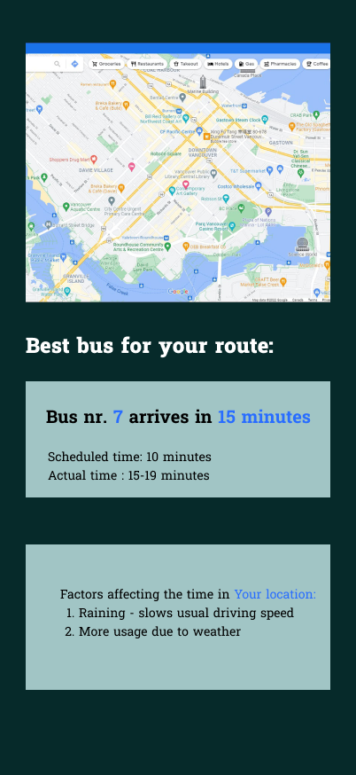

# Public transport arrival time

Final project for the Building AI course

## Summary
This project is about predicting bus arrival times based on real-world factors rather than relying on fixed schedules. For example, if a bus is scheduled to arrive at 17:00 but it's raining and there's a popular event in town, the actual arrival time might be closer to 17:15. The AI would calculate these real-time changes daily.

## Background

Problems:
* Not every town can afford tracking displays for public transport.
* Various factors can affect bus arrival times, making schedules unreliable.

## How is it used?
A mobile app would be the best option for this project since most people have access to smartphones. It would help busy individuals plan their time more efficiently by providing accurate arrival predictions, instead of making them wait 20 minutes at a bus stop (we've all been there). Alternatively, the program could display arrival times on public screens.

## Data sources and AI methods
### The data would vary depending on the country or region. Likely data sources include:
* Weather forecasts for the day.
* Usual busyness of public transport use at specific times.
* Special events or occasions from news and other sources (holidays, concerts, local events, etc.)
* Google Map API for showing map and planning route direction
### Ai methods:
* Natural language processing - Process unstructured data from news, social media, or traffic updates to detect events affecting bus timings (e.g., concerts, accidents)
*  Machine Learning for Time Series Forecasting -methods such as linear regression and desicion trees can learn patterns from historical data (e.g., past bus delays based on weather, traffic, and events) and predict future outcomes.
*  Reinforcement learning - Model real-time decisions by simulating bus routes and traffic conditions.
*  Clustering and Anomaly Detection -Group bus routes by similarities in delay patterns (e.g., routes with heavy traffic vs. routes with fewer delays).
*  Bayesian Models - Use probabilistic models to incorporate uncertainty in predictions.
  
## Challenges

Some countries might face difficulties due to limited smartphone access or a lack of reliable data. Ensuring data accuracy and availability would also be a significant challenge.
## What next?
To expand this project, large datasets from different regions or countries would be necessary. Implementing it worldwide would require considerable effort and resources. In some areas with small public transport systems, the project might not be justifiable due to low demand.
## Acknowledgments
https://developers.google.com/maps Google Maps Api for possible project uses.
